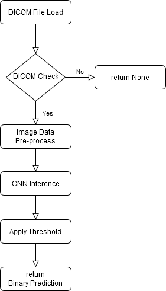
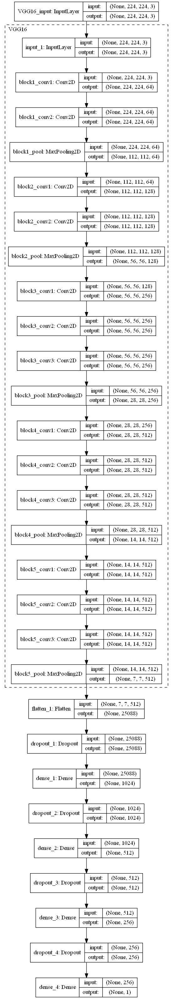

# FDA  Submission

**Your Name:**
Gennady Lungu

**Name of your Device:**
X-Ray Pneumonia Detection Assistant (XR-PDA)

## Algorithm Description 

### 1. General Information

**Intended Use Statement:**
 
For assisting a radiologist in detection of pneumonia in x-ray images.

**Indications for Use:**

Screening of x-ray images. 

Patient population:
* Both men and women
* Age: 2 to 90 

X-Ray image properties:
* Body part: Chest
* Position: AP (Anterior/Posterior) or PA (Posterior/Anterior)
* Modality: DX (Digital Radiography) 
 

**Device Limitations:**

The model is recommended for use without following comorbid thoracic pathologies:
* Consolidation
* Edema
* Effusion
* Hernia

**Clinical Impact of Performance:**

Inference can be performed on a general-purpose CPU found on most desktop PCs.
Performance has been tested on Intel(R) Xeon(R) @ 2.30GHz CPU, 
inference time is less than 850 milliseconds per image 
(including file read and image data preprocessing).

### 2. Algorithm Design and Function

**DICOM Checking Steps**

The algorithm performs the following checks on the DICOM image:

* Check Patient Age is between 2 and 90 (inclusive)
* Check Examined Body Part is 'CHEST'
* Check Patient Position is either 'PA' (Posterior/Anterior) or 'AP' (Anterior/Posterior)
* Check Modality is 'DX' (Digital Radiography)

**Preprocessing Steps**

The algorithm performs the following preprocessing steps on an image data:

* Converts RGB to Grayscale (if needed)
* Re-sizes the image to 244 x 244 (as required by the CNN)
* Normalizes the intensity to be between 0 and 1 (from original range of 0 to 255)   

**CNN Architecture**

The algorithm uses pre-trained VGG16 Neural Network (except the last block of 
Convolution + Pooling layers that was re-trained), 
with additional 4 blocks of 'Fully Connected + Dropout' layers.

The network output is a single probability value for binary classification.

Below is the CNN architecture graph:

### 3. Algorithm Training

**Parameters:**
* Types of augmentation used during training:
    * horizontal flip
    * height shift: 0.1
    * width shift: 0.1
    * rotation angle range: 0 to 20 degrees
    * shear: 0.1
    * zoom: 0.1
* Batch size: 32
* Optimizer learning rate: 1e-5
* Layers of pre-existing architecture that were frozen
    * All except last convolution + pooling block 
* Layers of pre-existing architecture that were fine-tuned
    * The last 2 layers of VGG16 network: block5_conv3 + block5_pool
* Layers added to pre-existing architecture
    * flatten_1     (Flatten)         
    * dropout_1     (Dropout)         
    * dense_1       (Dense,   1024)   
    * dropout_2     (Dropout, 0.2)          
    * dense_2       (Dense,   512)    
    * dropout_3     (Dropout, 0.2)
    * dense_3       (Dense,   256)    
    * dropout_4     (Dropout, 0.2)
    * dense_4       (Dense)   1    

#### Algorithm training performance visualization

The early stopping with patience of 10 epochs was used to stop the learning process.

The behaviour of the validation loss during training may indicate a possibility that
a lower learning rate could produce better results. This is left for future research. 
 

#### Model performance metrics depending on threshold

ROC Curve is not particularly impressive, but does show that the model 
has indeed learned something from the data.

As we can see, the model has low precision, but higher recall, 
and maintains high negative predictive value. 

**Final Threshold and Explanation:**

The maximum F1 score for the model is 0.408 and it is achieved with threshold value of 0.431.
Below is the comparison of F1 score with those given in 
[CheXNet: Radiologist-Level Pneumonia Detection on Chest X-Rayswith Deep Learning](
https://arxiv.org/pdf/1711.05225.pdf):

| Person or Device | F1    |
|------------------|-------|
| Radiologist 1    | 0.383 |
| Radiologist 2    | 0.356 |
| Radiologist 3    | 0.365 |
| Radiologist 4    | 0.442 |
| Radiologist Avg. | 0.387 |
| CheXNet          | 0.435 |
| XR-PDA Max F1    | 0.408 |
 
As we can see, this model achieves higher maximum F1 score than an average radiologist 
in the study. State of the art neural network, as well as one radiologist from the study,
do achieve higher F1 score, but the model's performance is comparable and in many cases 
exceeds the performance of human radiologists (in terms of F1 score).

Furthermore, since the model does not have a high precision with any meaningful recall value,
its usefulness tends to lie in its recall (and negative predictive value).
Therefore, it makes sense to maximize recall and NPV even at the cost of small loss in precision.
A good threshold value that achieves that is 0.377:

| Device           | F1    | Precision   | Sensitivity/Recall | Specificity | NPV   |
|------------------|-------|-------------|--------------------|-------------|-------|
| XR-PDA Max F1    | 0.408 |  0.290      |  0.689             |  0.579      | 0.856 |
| XR-PDA T=0.377   | 0.404 |  0.268      |  0.818             |  0.441      | 0.905 |

If the model predicts negative, it is correct with 90.5% probability. If the model 
predicts positive, it is correct with 26.8% probability.

Out of all negative cases the model correctly classifies 44.1%,
out of all positive cases it correctly classifies 81.8%.

### 4. Databases

**Description of Training Dataset:**

Training dataset consisted of 2290 chest xray images, with a 50/50 split between 
positive and negative cases. 

Example images: 

**Description of Validation Dataset:** 

Validation dataset consisted of 1430 chest xray images, with 20/80 split between 
positive and negative cases, which more reflects the occurence of pneumonia 
in the real world.
   

### 5. Ground Truth

The data is taken from a larger xray 
[dataset](https://www.kaggle.com/nih-chest-xrays/data), with disease labels 
created using Natural Language Processing (NLP) mining the associated 
radiological reports. The labels include 14 common thoracic pathologies 
(Pneumonia being one of them): 
- Atelectasis 
- Consolidation
- Infiltration
- Pneumothorax
- Edema
- Emphysema
- Fibrosis
- Effusion
- Pneumonia
- Pleural thickening
- Cardiomegaly
- Nodule
- Mass
- Hernia 

The biggest limitation of this dataset is that image labels were NLP-extracted so there 
could be some erroneous labels but the NLP labeling accuracy is estimated to be >90%.

The original radiology reports are not publicly available but more details 
on the labeling process can be found [here](https://arxiv.org/abs/1705.02315). 

### 6. FDA Validation Plan

**Patient Population Description for FDA Validation Dataset:**

The following population subset is to be used for the FDA Validation Dataset:
* Both men and women 
* Age 2 to 90 
* Without known comorbid thoracic pathologies listed above

**Ground Truth Acquisition Methodology:**

Ground truth for the FDA Validation Dataset should be obtained from a practicing radiologist.  

**Algorithm Performance Standard:**

The algorithm's performance measured on Intel(R) Xeon(R) @ 2.30GHz CPU: 

* Average image pre-processing time: 29 ms, max: 111 ms
* Average CNN inference time: 615 milliseconds, max: 734 ms

So, total inference time does not exceed 850 milliseconds on Intel Xeon CPU. 
Similar (or higher performance) CPU is recommended.